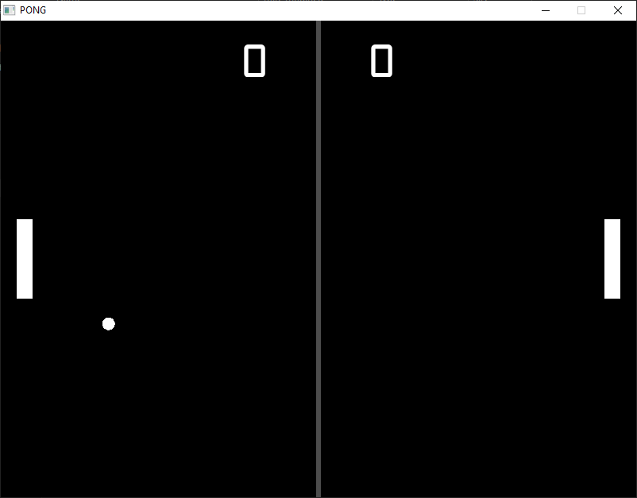
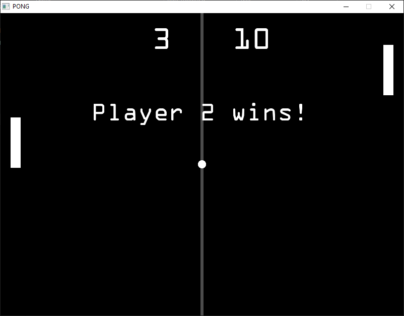

# Pong

This adaptation of pong is my first OpenGL and c++ project. Taking in consideration
that this is my first project using this technologies the code is not polished,
this way i can start a new project as soon as possible and consolidate more the
principles learned. For more polished projects please check the newer repos i'll
be creating.

## Dependencies

- OpenGL loader - [Glad 3.3](https://glad.dav1d.de/)
- Window manager - [GLFW 3.3.8](https://www.glfw.org/)
- TTF Font loader - [FreeType 2.13.2](https://github.com/ubawurinna/freetype-windows-binaries)
- Maths - [GLM 0.9.9.8](https://github.com/g-truc/glm)
- Compiler - [Mingw64 (gcc 13.2.0)](https://winlibs.com/)

## Install

```
git clone https://github.com/iuryferreiradev/pong.git
```

```
cd pong
build
```

Or double clink on the build.bat to build the project and run it.

## Screenshots

### Game screen


### Game over screen
